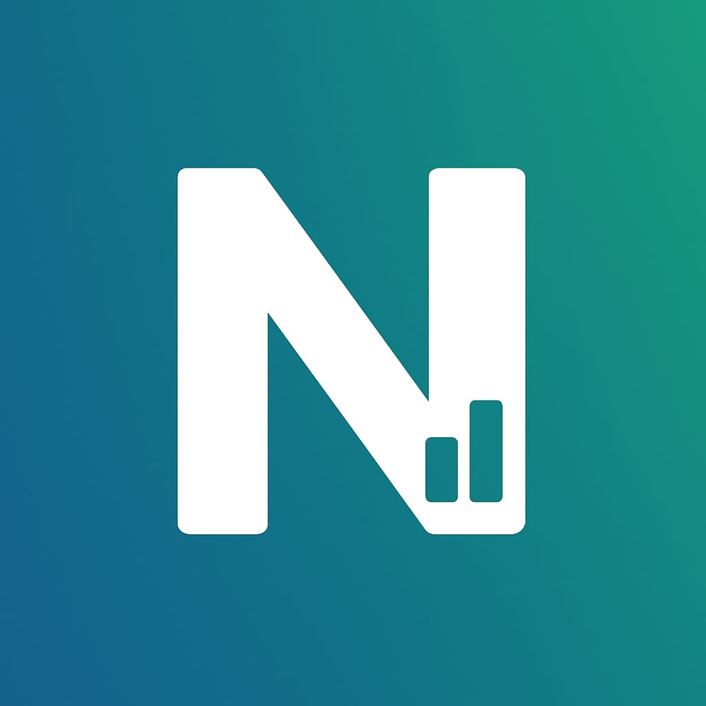

# Hello, I am Nahidur Rahman Tamim. A Data Enthusiast

- 👨‍💻 I'm a Mathematics Graduate.
- 🌱 I'm currently learning Data Analysis, Data Visualization.
- 💼 I'm looking to collaborate on projects or remote jobs related to data science.
- 💻 All of my projects are available at [https://github.com/NahidurRahmanTamim?tab=repositories](https://github.com/NahidurRahmanTamim?tab=repositories).
- 📫 How to reach me: [sktamim995@gmail.com](mailto:sktamim995@gmail.com)

[Resume](link-to-resume)

## Connect with me:

<!--
**NahidurRahmanTamim/NahidurRahmanTamim** is a ✨ _special_ ✨ repository because its `README.md` (this file) appears on your GitHub profile.

Here are some ideas to get you started:

- 🔭 I’m currently working on ...
- 🌱 I’m currently learning ...
- 👯 I’m looking to collaborate on ...
- 🤔 I’m looking for help with ...
- 💬 Ask me about ...
- 📫 How to reach me: ...
- 😄 Pronouns: ...
- ⚡ Fun fact: ...
-->
